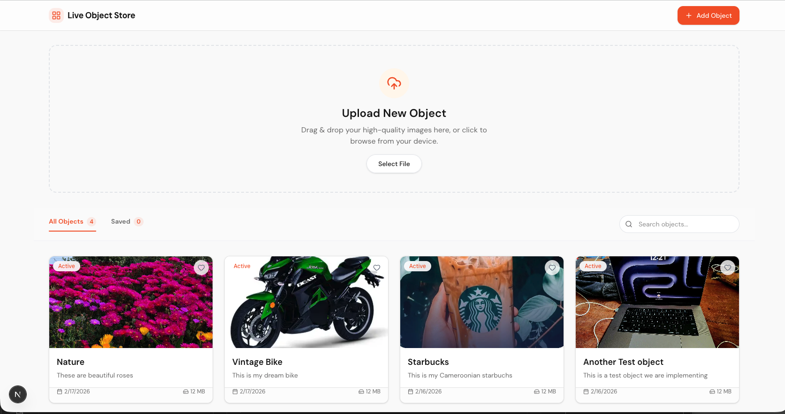
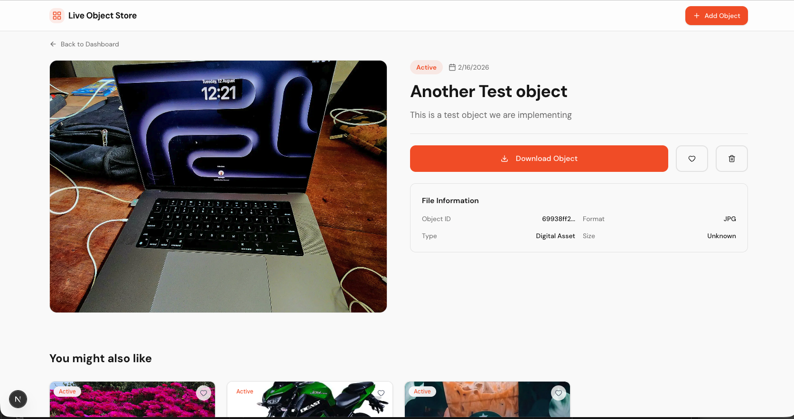
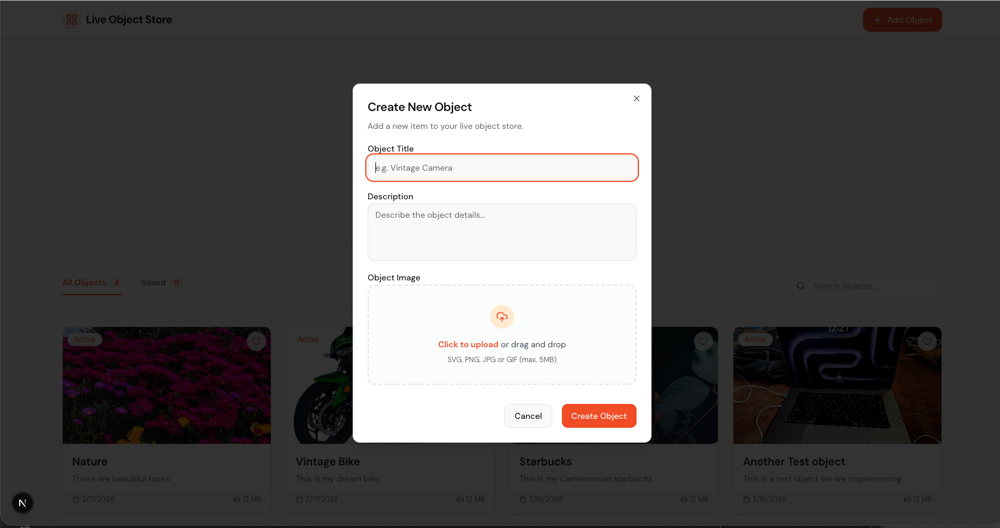
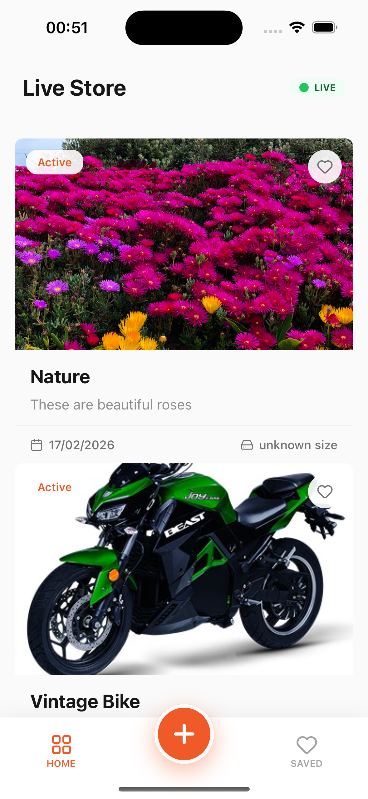
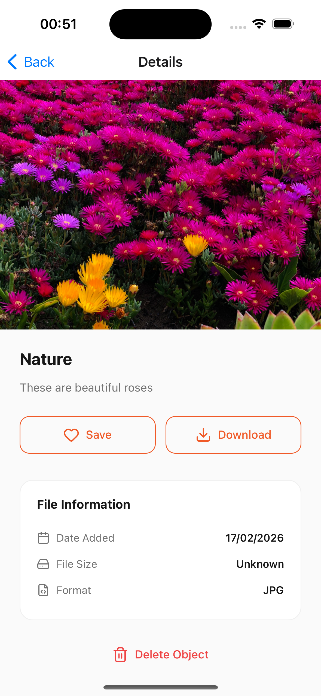
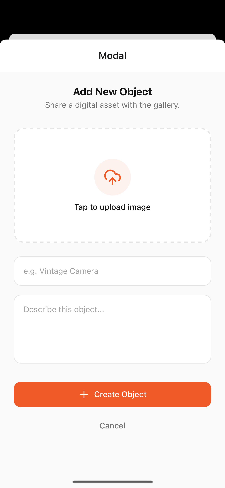

# Live Object Store

A real-time, cross-platform digital asset management system. This project features a robust **NestJS backend**, a  **Next.js web dashboard**, and an **Expo mobile application**, all synchronized via **WebSockets**.

**🌐 Deployed Application**: [https://live-object.netlify.app/](https://live-object.netlify.app/)
> [!NOTE]
> The backend for the live demo is hosted on a free Render instance that spins down after 15 minutes of inactivity. If the site takes a moment to load initially, the server is just waking up!

---

## Visuals

### 🌐 Web Dashboard
| Home Screen | Object Details | Upload Zone |
| :---: | :---: | :---: |
|  |  |  |

### 📱 Mobile Application
| Home Screen | Object Details | Upload Modal |
| :---: | :---: | :---: |
|  |  |  |

### 🎥 Video Recording

https://github.com/user-attachments/assets/1d7edfda-d2ec-4531-a09b-895dfea357d7


---

## Project Structure

- `server/`: NestJS Backend API & WebSockets.
- `client/web/`: Next.js frontend application.
- `client/mobile/`: Expo/React Native mobile application.

---

## Server (Backend)

The backbone of the system, handling data persistence, file storage (Supabase), and real-time event broadcasting.

### Getting Started
1. `cd server`
2. `npm install`
3. Create a `.env` file with:
   ```env
   MONGO_URI=your_mongodb_uri
   SUPABASE_URL=your_supabase_url
   SUPABASE_KEY=your_supabase_key
   PORT=3000
   ```
4. `npm run start:dev`

### API Endpoints
- `GET /api/objects` - Retrieve all objects.
- `GET /api/objects/:id` - Get details for a specific object.
- `POST /api/objects` - Create a new object (Multipart/form-data with image).
- `DELETE /api/objects/:id` - Delete an object.

### WebSockets (Socket.io)
The server broadcasts real-time updates to all connected clients:
- `new_object`: Emitted when a new object is created.
- `delete_object`: Emitted when an object is deleted.

---

## Web Client

A sleek, responsive dashboard for managing your digital assets.

**Live Demo**: [https://live-object.netlify.app/](https://live-object.netlify.app/)

###  Getting Started
1. `cd client/web`
2. `npm install`
3. Create a `.env.local` file with:
   ```env
   NEXT_PUBLIC_SERVER_URL=http://localhost:3000
   ```
4. `npm run dev`

### Features
- Real-time list updates without refreshing.
- Batch upload zone with drag-and-drop.
- Search and "Saved" filtering.
- Beautiful, high-performance UI using Tailwind CSS.

---

## Mobile Client (iOS & Android)

A premium mobile experience built with Expo Router and custom animations.

### Getting Started
1. `cd client/mobile`
2. `npm install`
3. Create a `.env` file with:
   ```env
   EXPO_PUBLIC_API_URL=http://localhost:3000
   ```
4. `npm run ios` or `npm run android` (Press `i` for iOS or `a` for Android)

### Features
- **Live Status Indicator**: Visual indicator of server connectivity.
- **Premium Card Design**: Native-feeling cards with image overlays and detailed metadata.
- **Real-time Sync**: Uses WebSockets to keep the feed alive as changes happen on the server/web.
- **Platform-Native Navigation**: Optimized headers for both iOS and Android.


